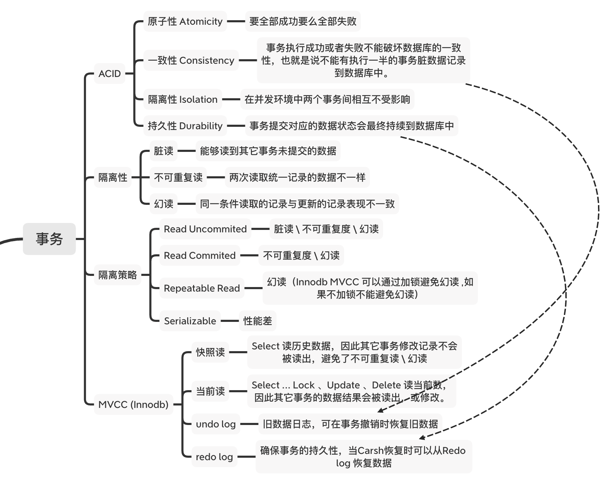

# Spring 事务

## Mysql 事务





## Spring 框架 事务传播行为类型

``` 
REQUIRED（默认）	如果当前没有事务，就新建一个事务，如果已经存在一个事务中，加入到这个事务中。
SUPPORTS	    支持当前事务，如果当前没有事务，就以非事务方式执行。
MANDATORY	    使用当前的事务，如果当前没有事务，就抛出异常。
REQUIRES_NEW	新建事务，如果当前存在事务，把当前事务挂起。
NOT_SUPPORTED	以非事务方式执行操作，如果当前存在事务，就把当前事务挂起。
NEVER	        以非事务方式执行，如果当前存在事务，则抛出异常。
NESTED	        如果当前存在事务，则在嵌套事务内执行。如果当前没有事务，则执行与PROPAGATION_REQUIRED类似的操作。
```

## 测试

* TransactionExampleServiceTest#readOnlyTest 只读测试
* TransactionExampleServiceTest#rollbackTest 只读测试
* TransactionExampleServiceTest#propagationRequiredTest REQUIRED 传递性测试
* TransactionExampleServiceTest#propagationNotSupportTest NOT_SUPPORTED 传递性测试
* TransactionExampleServiceTest#timeoutTest 超时测试